# Transformer-Powered Trading Simulator

A powerful **backtesting framework** built on [Backtrader](https://www.backtrader.com/) that integrates a **custom Transformer model** for time series forecasting. This project demonstrates how deep learning — specifically a **Transformer trained on market features** — can be used to guide trading decisions in a systematic, backtestable way.

---

## Project Focus

This project is **centered around a Transformer neural network** that I have created and trained on multivariate financial time series data (price + technical indicators). It uses the model's **future price prediction** to influence live trading decisions within a backtesting simulation.

---

## Most Recent Results


### Strategy Performance


These are results following the **backtesting** of our strategy on a **variety of stocks**. The stock price changing through time is displayed with equity and broker cash above allowing for insightful evaluations on where the strategy is going **wrong/right**. 


<p align="center">
  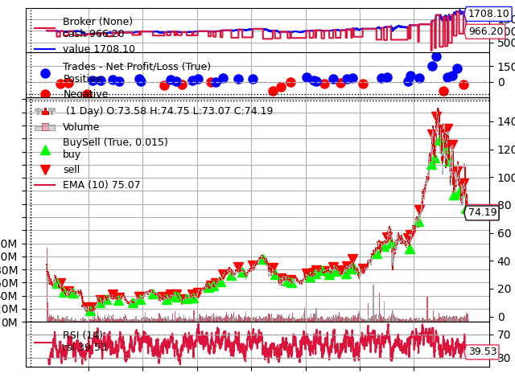
  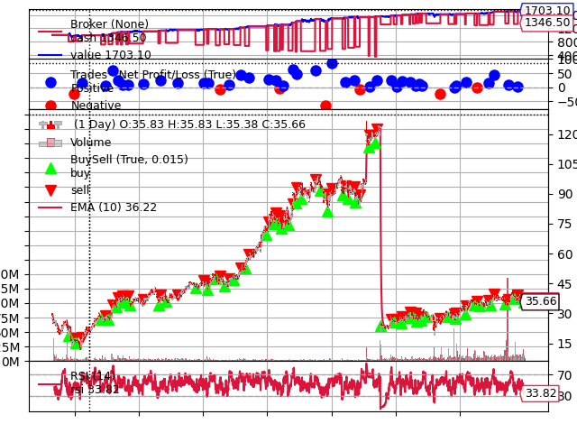
</p>

<p align="center">
  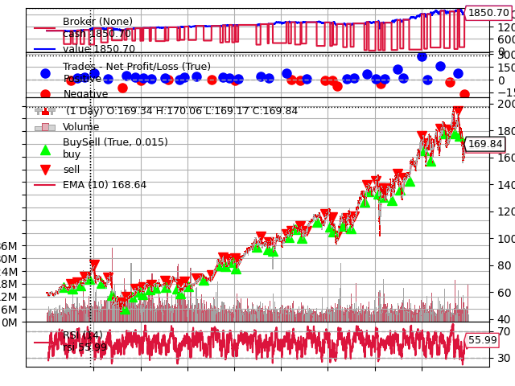
  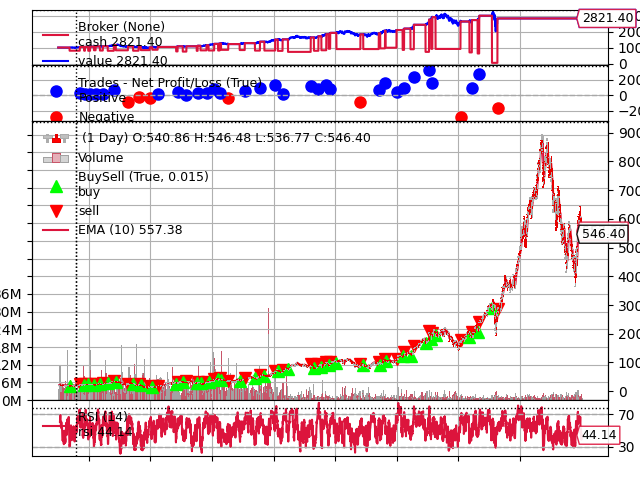
</p>

<p align="center">
  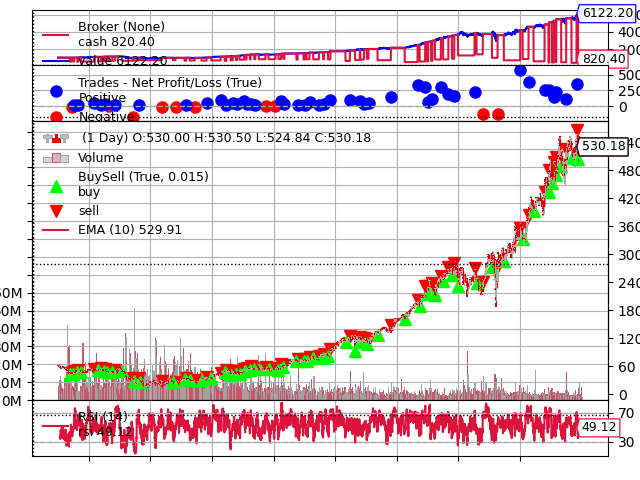
</p>

**BX** – Total return of **+70.81%** with a Sharpe ratio of **0.31**. A solid performance, though risk-adjusted returns that are modest.  
**KDP** – Total return of **+70.31%** with a Sharpe ratio of **0.71**, shows better risk-adjusted performance compared to BX.

**PEP** – Total return of **+85.07%**, Sharpe ratio **0.43**. Steady growth with moderate risk-adjusted returns.  
**ASML** – Total return of **+182.14%** with a Sharpe ratio of **0.62**. Strong absolute performance but with higher volatility compared to lower-risk names. 

**UNH** – Standout performer with a **+512.22%** total return and Sharpe ratio **0.95**. Exceptional growth and strong risk-adjusted returns.

---

### Equity Curves


These are the equity curves of the following result in a much more clear format in order to evaluate the **smoothness** without over optimising the smoothness to detriment. 


<p align="center">
  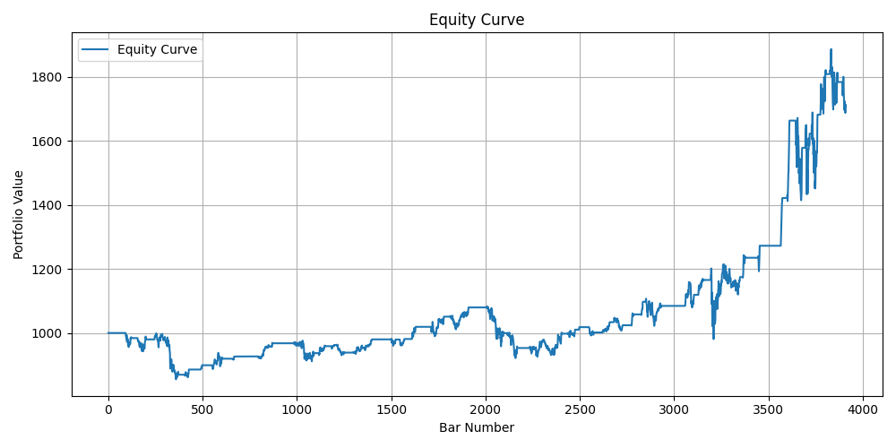
  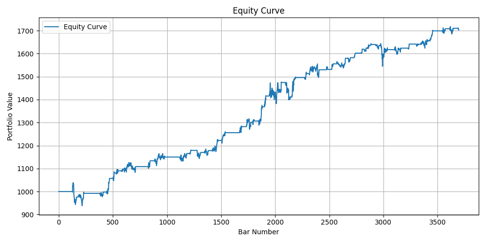
</p>

<p align="center">
  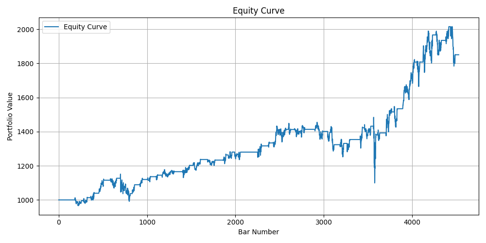
  
</p>

<p align="center">
  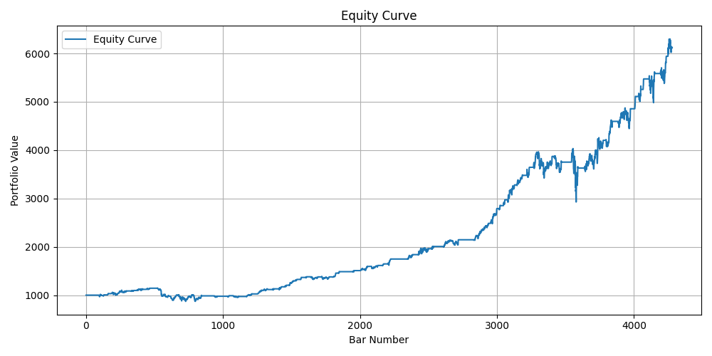
</p>

**BX** – Max drawdown of **18.36%**, win rate **65.91%**, profit factor **2.69** – healthy trade consistency with manageable risk.  
**KDP** – Only **9.67%** drawdown, win rate **82.61%**, profit factor **6.35** – extremely low risk profile with strong trade efficiency.

**PEP** – Max drawdown of **25.91%**, win rate **65.91%**, profit factor **2.82** – stable but with slightly higher risk exposure.  
**ASML** – Max drawdown of **37.46%**, win rate **78.38%**, profit factor **3.53** – impressive returns but at the cost of deeper drawdowns and increased volatility.

**UNH** – Max drawdown of **27.39%**, win rate **92.86%**, profit factor **11.70** – great consistency and profit quality despite higher peak-to-trough declines.

**Conclusions**  
- **UNH** was the standout performer, with over **500% total return**, a **92% win rate**, and exceptionally high **profit factor**.  
- **KDP** had the lowest drawdown (under 10%), making it attractive for low-volatility portfolios.  
- **ASML** delivered strong absolute returns but faced the highest drawdowns, implying higher risk.  
- **PEP** and **BX** had moderate returns with balanced risk metrics.  

---

### Multi-Stock Comparisons

<p align="center">
  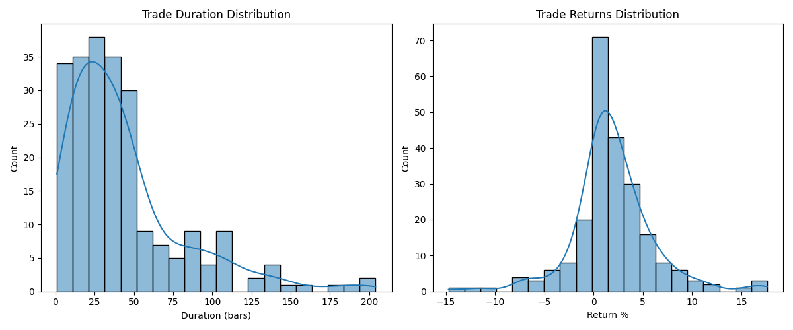
</p>

We can see by these distributions that the strategy tends to go with **shorter (20-30) day trades** which matches how the model predicts only 5 days in advanced and hence only thinks short term for trades, this means we see it can adapt to changes in prices made in that time range and hence best suited to **less choppy stocks** as it can take advantage of the upward momentum and determine when to go short with its trades. This is reflected on these short snappy wins by most wins being **small but frequent winners**, this can be improved by decreasing the amount of larger losses we suffer.

<p align="center">
  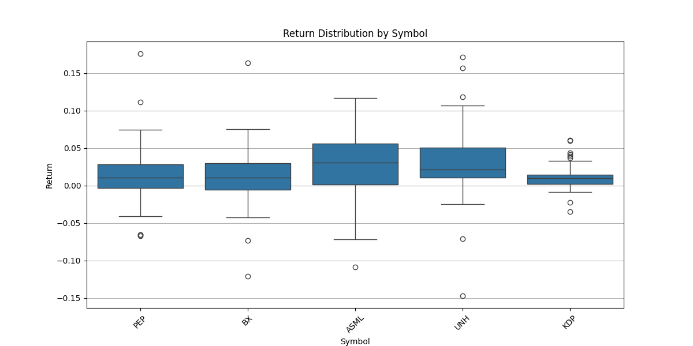
  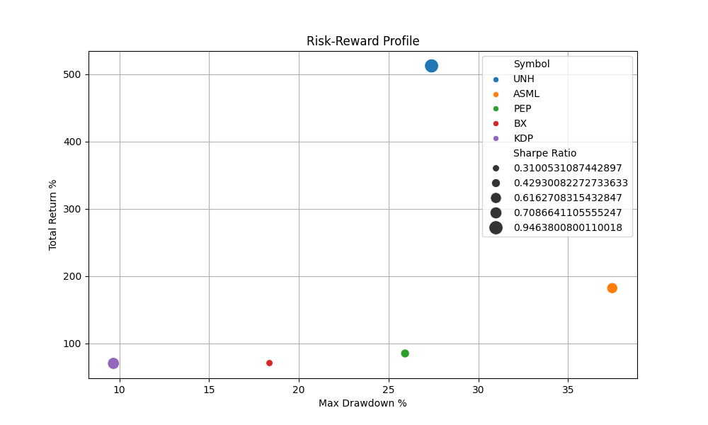
</p>

As for returns we notice all are matching the normal distribution we saw previously and with a few outliers but on general it is a very nice and **compressed spread** of returns that win. This is reflected in the Risk-Reward where the risk is mostly corrolated to the reward where we have adopted a less risky approach. 

<p align="center">
  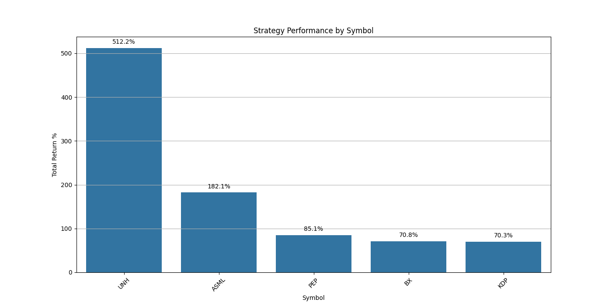
</p>

This reflects the general **positive results** of the strategy that show the model to be effectively understanding and on general performing with **consistency**. 


## Strategy: `RsiEmaStrategy`

This strategy is a **hybrid of deep learning and technical analysis**:

- Uses RSI + EMA for signal confirmation
- The core decision logic is driven by my **Transformer model** trained to predict the `close` price based on a feature-rich window of past data
- Trades are only triggered when both the **Transformer prediction** and traditional indicators align

### Input Features to Transformer:
- `close`
- `volume_zscore`, `rsi`, `macd`, `overnight_gap`, `return_lag_1`, `return_lag_3`, `return_lag_5`, `volatility`

### New Input Features to Transformer:
- `close`
- `high`, `low`, `volume`,`adj close`,`P`, `R1`, `R2`, `R3`, `S1`, `S2`, `S3`,`obv`, `volume_zscore`, `rsi`, `macd`,`macds`,`macdh`, `sma`,`lma`,`sema`,`lema`,`overnight_gap`, `return_lag_1`, `return_lag_3`, `return_lag_5`, `volatility`, `SR_K`, `SR_D`, `SR_RSI_K`, `SR_RSI_D`, `ATR`, `HL_PCT`, `PCT_CHG`

### Trigger Logic:

```python
If RSI < 40 and Predicted Close > Current Price * 1.005 → BUY
If RSI > 60 and Predicted Close < Current Price * 0.995 → SELL
```

## Transformer Model Details

### Architecture: Encoder-decoder Transformer

### Trained with:

seq_len = 30

label_len = 10

pred_len = 5

Loss Function: MSE

Framework: PyTorch

Uses multivariate inputs and predicts future close prices

Scaling handled via scaler.pkl

### Previous Analysis

### Calculates:

- Sharpe Ratio
- Max Drawdown
- Win Rate
- Profit Factor
- Avg Risk/Reward
- Total Return

### Previous Performance Metrics 

- Sharpe Ratio: 0.43
- Max Drawdown: 3.63%
- Win Rate: 78.09%
- Profit Factor: 3.43
- Total Return: 95%

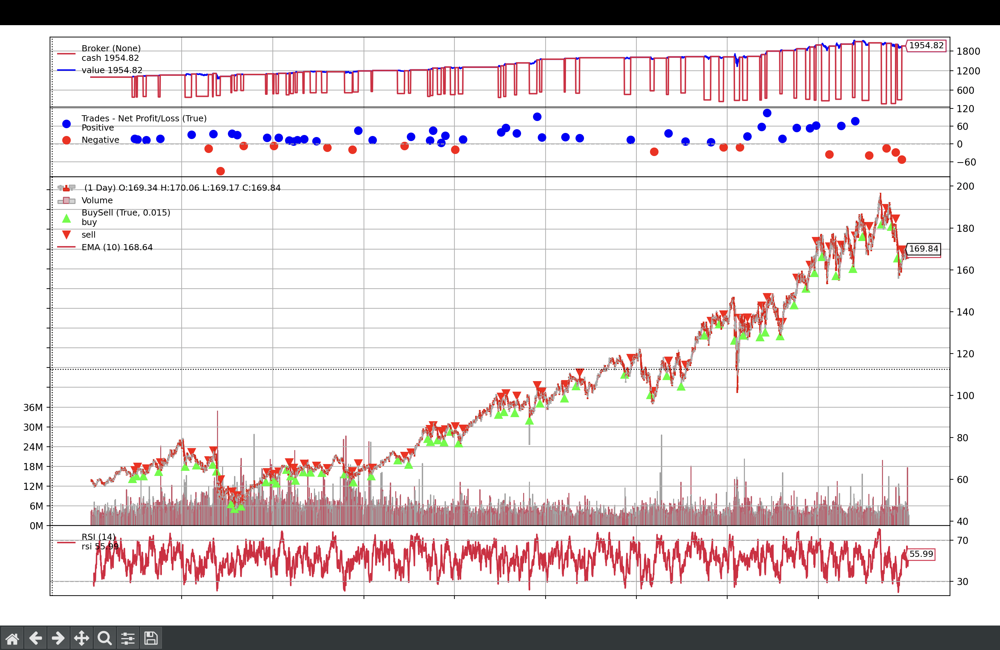


