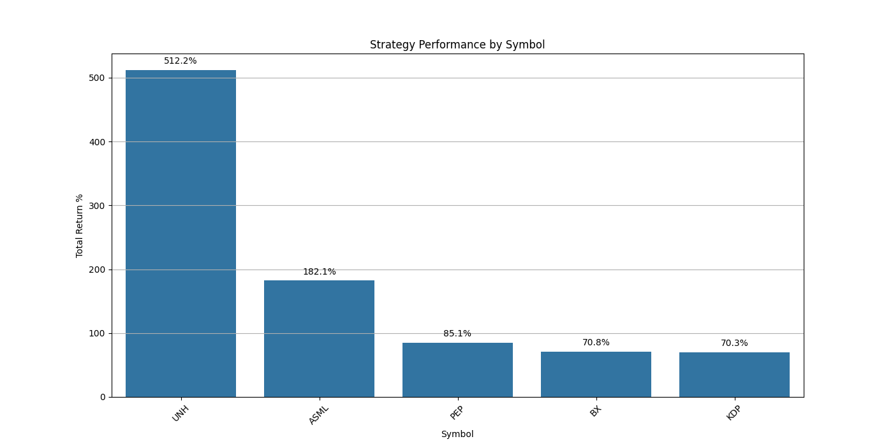
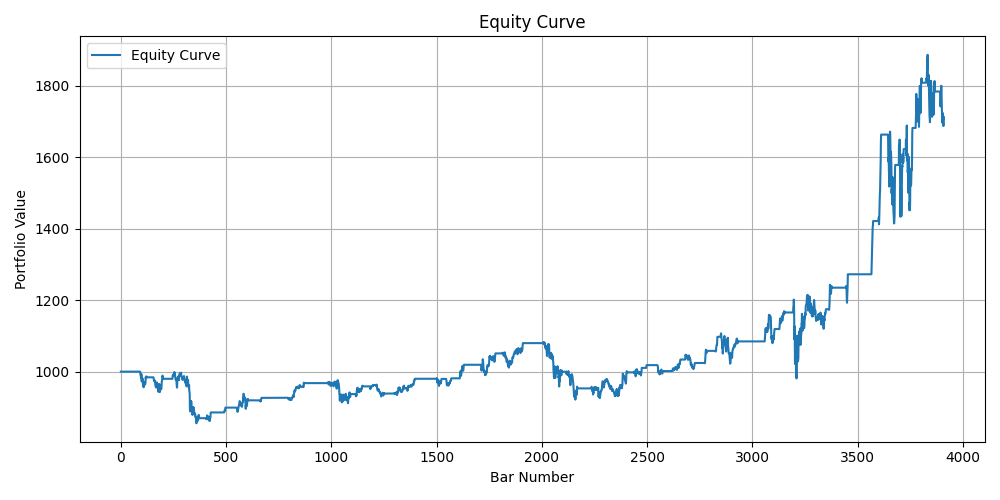
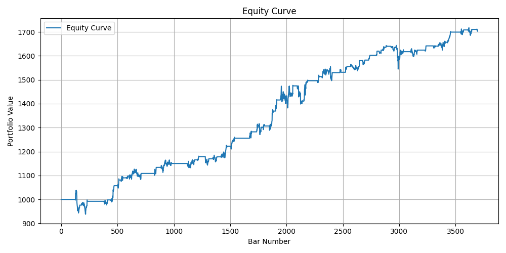
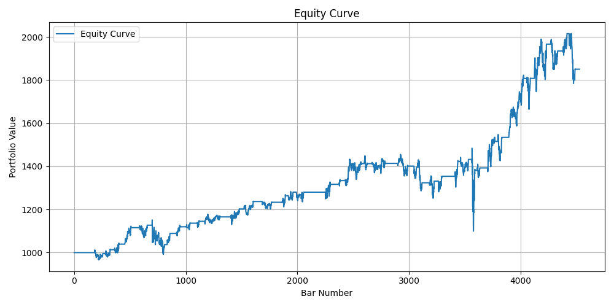
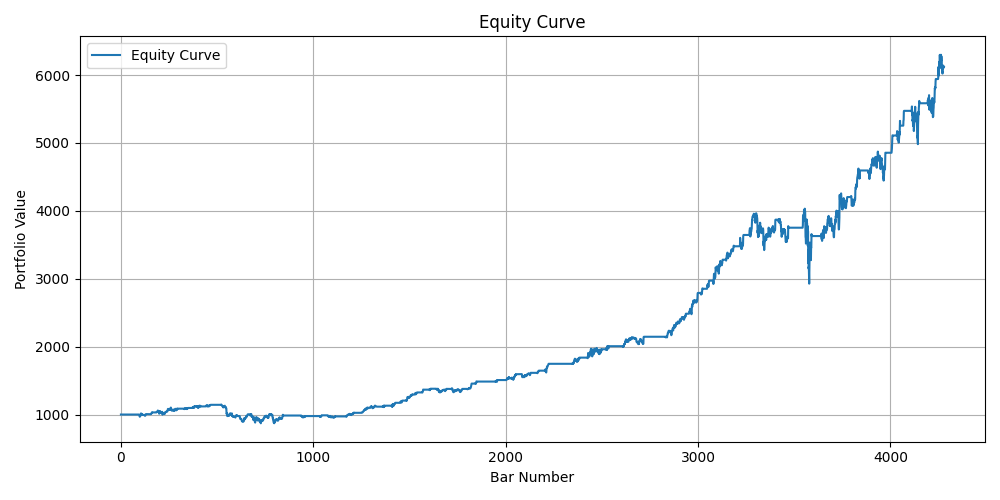
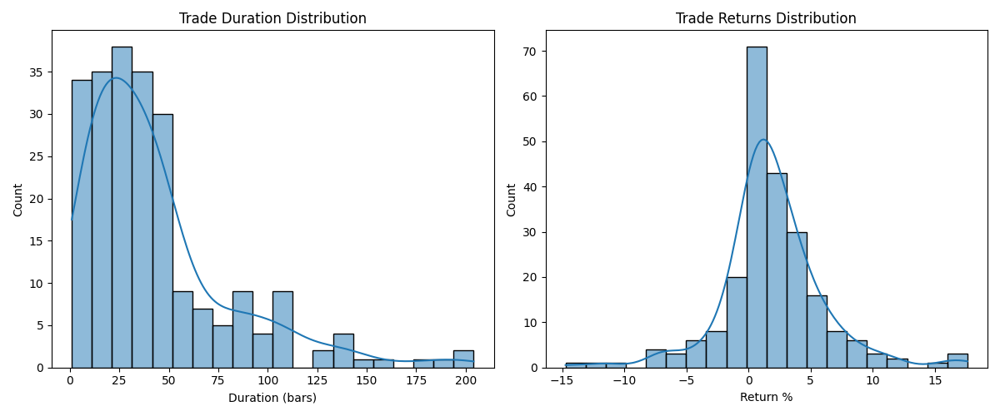

# TradingTransformer

A modular, event-driven backtesting system for evaluating machine learning trading strategies. A custom encoder-decoder Transformer is trained on 34 engineered features, exported to a C++ runtime via LibTorch, and executed inside a strongly-typed event pipeline — keeping the research layer and execution layer independently deployable and testable.

[](https://github.com/DylanTombs/TradingTransformer/actions/workflows/python-app.yml)
[](https://github.com/DylanTombs/TradingTransformer/actions/workflows/build.yml)
[](https://github.com/DylanTombs/TradingTransformer/actions/workflows/codeql.yml)

---

## System Overview

```
Raw OHLCV CSVs
      │
      ▼
Feature Pipeline (Python)           34 technical indicators, bar-by-bar,
                                    identical logic to training
      │
      ▼
Transformer Training (PyTorch)      Encoder-decoder, seqLen=30, predLen=5
      │
      ▼
Model Export (TorchScript)          torch.jit.trace → .pt file
StandardScaler Export               mean/scale per feature → CSV
      │
      ▼
C++ Backtesting Engine              Event-driven: MARKET→SIGNAL→ORDER→FILL
  ├── FeatureCSVDataHandler          Reads feature CSVs, emits typed events
  ├── MLStrategy                     Buffers 30 bars, runs LibTorch inference
  ├── Portfolio                      Position accounting, equity curve
  ├── RiskManager                    Pre-trade order approval
  └── SimulatedExecution             Fill simulation at market price
      │
      ▼
ml_equity.csv  ml_trades.csv
```

---

## Key Features

- **No Python at inference time.** The model runs inside the C++ engine via `torch::jit::load()`. No subprocess calls, no shared memory, no FFI boundary overhead.
- **Train/serve feature parity.** `pipeline.py` wraps a pandas DataFrame in a backtrader-compatible adapter and calls the same indicator functions used during training. Indicator drift between training and inference is structurally prevented.
- **Typed event hierarchy.** `FeatureMarketEvent` inherits from `MarketEvent`, so the engine's `static_pointer_cast<MarketEvent>` is valid without modification. `MLStrategy` recovers the feature payload via `dynamic_cast` — backward-compatible with non-ML strategies.
- **Portable scaler.** `ScalerParams` is a header-only struct that mirrors `sklearn.StandardScaler`. Parameters are loaded from a CSV written at export time — no Python dependency in the C++ build.
- **Optional LibTorch.** The `ml_backtest` target is only built when `find_package(Torch)` succeeds. All other targets — including `backtester_tests` — compile and pass without LibTorch installed.
- **CI coverage across both layers.** GitHub Actions runs `pytest` on the Python layer and `ctest` on the C++ layer on every push. CodeQL performs static analysis on both.

---

## Quick Start

```bash
git clone https://github.com/DylanTombs/TradingTransformer.git
cd TradingTransformer

python -m venv .venv && source .venv/bin/activate
pip install -r requirements.txt
cp .env.example .env          # fill in model hyperparameters
```

---

## Running a Backtest

### Step 1 — Build feature CSVs

```bash
python research/features/pipeline.py data/ -o features/
```

### Step 2 — Train and export

```bash
python research/training/Train.py
python research/exportModel.py
# → models/transformer.pt
# → models/feature_scaler.csv
# → models/target_scaler.csv
```

### Step 3 — Build the C++ engine

```bash
# Without LibTorch (tests only)
cmake -S backtester -B build
cmake --build build --parallel $(nproc)

# With LibTorch (ML backtest)
cmake -S backtester -B build -DCMAKE_PREFIX_PATH=/path/to/libtorch
cmake --build build --parallel $(nproc)
```

### Step 4 — Run

```bash
./build/ml_backtest \
    features/AAPL_features.csv \
    AAPL \
    models/transformer.pt \
    models/feature_scaler.csv \
    models/target_scaler.csv
```

---

## Results

Results from backtesting `MLStrategy` across five large-cap equities using the same trained model without per-symbol fine-tuning.

| Symbol | Total Return | Sharpe Ratio | Max Drawdown | Win Rate | Profit Factor |
|--------|-------------|--------------|--------------|----------|---------------|
| BX     | +70.81%     | 0.31         | 18.36%       | 65.91%   | 2.69          |
| KDP    | +70.31%     | 0.71         | 9.67%        | 82.61%   | 6.35          |
| PEP    | +85.07%     | 0.43         | 25.91%       | 65.91%   | 2.82          |
| ASML   | +182.14%    | 0.62         | 37.46%       | 78.38%   | 3.53          |
| UNH    | +512.22%    | 0.95         | 27.39%       | 92.86%   | 11.70         |

> No buy-and-hold baseline is included in the current results. This is a known gap — see [Limitations](#limitations).

<p align="center">
  
</p>

<p align="center">
  
  
</p>

<p align="center">
  
  
</p>

<p align="center">
  
</p>

---

## Project Structure

```
TradingTransformer/
├── .github/workflows/          CI: pytest, ctest, CodeQL
├── backtester/
│   ├── include/                Public C++ headers (events, strategy, portfolio, engine)
│   ├── src/                    Implementations
│   ├── tests/                  Google Test suite (portfolio + engine integration)
│   ├── main.cpp                MovingAverage strategy entry point
│   └── ml_main.cpp             ML strategy entry point
├── research/
│   ├── features/
│   │   ├── pipeline.py         Feature engineering (bar-by-bar, 34 features)
│   │   └── technicalIndicators.py  Shared indicator functions (training + inference)
│   ├── transformer/            Model definition, training loop, dataset
│   ├── training/Train.py       Training entry point
│   └── exportModel.py          TorchScript export + scaler CSV generation
├── tests/                      pytest suite (indicators, dataset, metrics, model)
├── data/                       Raw OHLCV CSVs
├── models/                     Exported model artefacts (.pt, scaler CSVs)
└── requirements.txt
```

---

## Limitations

- **No buy-and-hold baseline.** Current results cannot be compared to a passive strategy. Adding a benchmark column to output CSVs is straightforward and planned.
- **Slippage is not modelled.** Fills execute at the last bar's close price. Real execution would incur bid-ask spread and market impact.
- **Fixed position sizing.** `Portfolio::generateOrder` currently uses a hardcoded quantity of 10 shares. A risk-based sizing model (e.g. fixed-fractional) is needed before the system reflects realistic capital allocation.
- **EXIT signal does not close the full position.** `generateOrder` for `SignalType::EXIT` currently returns a zero-quantity order. This is a known bug — the position is never actually liquidated.
- **Single-asset only.** The engine processes one symbol per run. Portfolio-level correlation and capital allocation across multiple instruments are not implemented.
- **Sharpe calculation uses per-trade returns.** The correct input is daily portfolio returns. The current metric is directionally useful but not comparable to industry-standard Sharpe ratios.
- **No walk-forward or out-of-sample validation.** All reported results use a fixed train/test split. Reported metrics may overstate generalisation.

---

## Future Work

- Fix `Portfolio::generateOrder` EXIT handling and introduce risk-based position sizing
- Add buy-and-hold baseline to all output reports
- Walk-forward validation to assess out-of-sample robustness
- Multi-asset portfolio mode with capital allocation across symbols
- Realistic slippage and commission models
- Hyperparameter sweep via Optuna, logged to a results table
- Online feature computation so raw CSVs can be used directly without a separate pipeline step
